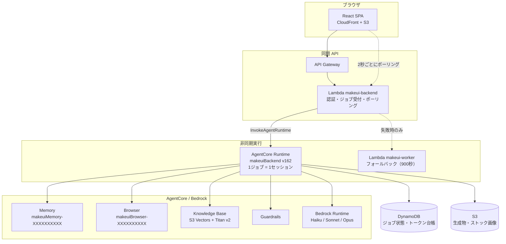
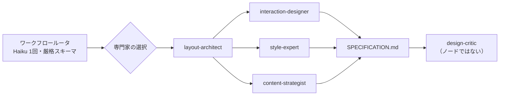

# 08. AgentCore と Strands の設計

MakeUI が Bedrock AgentCore の各サービスを何に使い、Strands Agents SDK でマルチ
エージェントをどう組んでいるかの説明資料です。

このファイルは**現在のコードから起こしています**。数値はすべて同一ブリーフでの実測で、
「こう設計した」ではなく「こう測れたのでこうなっている」という順で書いてあります。
採用しなかったもの・やめたものも、理由とともに残しています。

- 対象コミット時点の Runtime: `makeuiBackend` **v162**（`READY`）
- リージョン: `ap-northeast-1` / アカウント `<ACCOUNT_ID>`

---

## 1. 全体像



同期の API と、時間のかかる生成とを分けているのが基本形です。分けている理由は
単純で、**複数画面の TypeScript プロジェクトの生成は API Gateway の 29 秒に収まらない**
からです。Lambda は受け付けて 202 を返し、Runtime が数分かけて作ります。

---

## 2. AgentCore Runtime

### 2.1 何をしているか

`makeuiBackend` は **1 ジョブ 1 セッション**で動きます。セッションごとに独立した
microVM が与えられるので、同時に走るジョブが互いに干渉しません。

中身は素の HTTP サーバです（`src/handlers/runtime-handler.ts`）。

| パス | メソッド | 用途 |
|---|---|---|
| `/ping` | GET | ヘルスチェック |
| `/invocations` | POST | ジョブ本体 |

`PORT` は環境変数（既定 8080）、ネットワークは `PUBLIC`。配布はコンテナではなく
**zip を S3 に置く形式**です（`infrastructure/deploy-runtime.sh` が
`dist/makeui-backend.zip` を作り、`agent-runtime-artifact` の `codeConfiguration`
で参照）。したがって ECR リポジトリは存在せず、イメージの蓄積もありません。

### 2.2 なぜ Lambda ではないのか

Lambda の上限は 900 秒です。実測で `thinking` プロファイルの生成は**それを超えます**
（ファイル単位ビルド + 5 回の修復 + ブラウザ検証）。Runtime はセッションが数時間
生きられるので、上限が設計を歪めません。

`makeui-worker` Lambda は**意図的に残してあります**。Runtime の呼び出しが失敗したら
旧来の 900 秒経路へ落ちます。

```ts
// src/handlers/lambda-handler.ts — dispatchJob()
if (AGENT_RUNTIME_ARN) {
  try { await agentCoreClient.send(new InvokeAgentRuntimeCommand({ ... })); return null }
  catch (err) { logger.error('Runtime invoke failed, falling back to worker Lambda', ...) }
}
await lambdaClient.send(new InvokeCommand({ FunctionName: FUNCTION_NAME, InvocationType: 'Event', ... }))
```

> **運用上の注意.** worker の呼び出し回数は 14 日間 **0** です。これは死んでいるのでは
> なく、Runtime が健全だったという意味です。0 回であることを理由に消さないでください。

### 2.3 セッション ID

AgentCore はセッション ID に 33 文字以上を要求します。ジョブ ID は UUID（36 文字）
なので通常はそのままですが、短い ID が来たときに**ジョブではなく呼び出しが失敗する**
のを避けるため詰め物をしています。

```ts
function sessionIdFor(jobId: string): string {
  return jobId.length >= 33 ? jobId : `${jobId}-makeui-session-padding-0000000000`.slice(0, 40)
}
```

### 2.4 デプロイと進行中ジョブ

**Runtime を更新すると、実行中のジョブは落ちます。** 実測: 17:38 に走っていた 3 件が
停止し、17:39:47 に v130 へ切り替わっていました。CI/CD からのデプロイも同じです。
検証を回す前にパイプラインがアイドルであることを確認してください。

---

## 3. AgentCore Memory

### 3.1 何を憶えているか

**イベントではなく決定**を憶えます。以前は `Generated digital-agency UI: "<prompt>"`
のような記録でしたが、これは検索できても役に立ちません — 次の画面を設計する助けに
一切ならないからです。

現在保存するのは `summariseDesignDecisions()` が作る**構造化された設計判断**です
（配色、タイポグラフィ、密度、角丸、アクセントの使い方など）。

### 3.2 名前空間

Memory リソースが宣言している名前空間テンプレートは
`/strategies/{memoryStrategyId}/actors/{actorId}/` で、**この外に書いた記録は検索から
見えません**。したがって名前空間は手書きせず、strategy id から組み立てます。

```ts
function namespaceFor(strategy: string, userId: string): string {
  return `/strategies/${strategy}/actors/${userId}/`
}
```

strategy id は SSM の `/makeui/agentcore/memory-strategy-id` から取ります。

### 3.3 記録を構造として扱っている理由

自由文ではなく構造として扱うことで、次の 3 つができます。

1. **判断を含まない記録を弾く** — 「作った」だけの記録は捨てる
2. **同じ判断の重複を畳む**
3. **ストアを有界に保つ** — `pruneActorMemory()` が古い・重複した記録を削除する

3 番目が要点です。設計フェーズに渡す記録は 1 件ごとにプロンプト予算を消費するので、
無制限に増えると生成のたびに費用が上がり続けます。

使う API は `RetrieveMemoryRecordsCommand` / `BatchCreateMemoryRecordsCommand` /
`ListMemoryRecordsCommand` / `BatchDeleteMemoryRecordsCommand`。

### 3.4 書き込む条件

**記録する値そのものを読む監査**を通過した出力だけを記録します（2026-09-10 に変更）。

```ts
const blockers = [
  ...(toRunnableDocument(finalHtml, outputKind).error ? ['not-runnable'] : []),
  ...auditAiTells(finalHtml, presetName, outputKind).map((d) => d.id),
  ...auditDesignSystem(finalHtml).map((d) => d.id),
]
const clean = blockers.length === 0
```

ビルドできない文書には、静的監査がいくら綺麗でも学ぶ価値のある判断はありません
— 描画できない文書を読んでいるだけだからです。

以前は `auditInteractivity`・`auditShellContract`・`auditSeedData` も通過を求めて
いましたが、記録するのはパレット・書体・角丸・影・画面数で、「ナビのリンクが死んでいる」
「シードデータが平坦」は**パレットを信用しない理由になりません**。しかもこれらは頻出の
指摘（`imagery-missing` 119・`action-dead-runtime` 92・`shell-without-nav` 59、30日間）で、
実質すべての実行を門前払いにしていました。変更前の実測は、30日で **35件書き込み・
244件スキップ**（8回に1回）です。

---

## 4. AgentCore Browser

### 4.1 唯一「適用されなかったが残した」サービス

Code Interpreter と Policy Engine は削除しました（後述）。Browser だけは残しています。
理由は、**ソースを読むだけでは分からないことがある**からです。

実測でそれが分かった例:

- 静的スコア **92 点・検出欠陥ゼロ**のダッシュボードが、コンテンツをビューポートの
  3 分の 1 で止めていた
- Gantt 画面を追加した編集が「成功」を報告し、チャートは空の箱のままだった

どちらもレンダリングした瞬間に明らかで、どちらもマークアップ上のパターンとしては
表現できません。

### 4.2 どう使っているか

```ts
const session = await client.send(new StartBrowserSessionCommand({
  browserIdentifier: BROWSER_ID,
  name: 'makeui-verify',
  sessionTimeoutSeconds: 180,
  viewPort: VIEWPORT,
}))
const endpoint = session.streams?.automationStream?.streamEndpoint
```

`automationStream` の endpoint へ **SigV4 署名した WebSocket** で繋ぎ、**CDP**
（Chrome DevTools Protocol）を直接話します。Playwright などは挟んでいません。

計測しているもの:

| 計測 | 何を捕まえるか |
|---|---|
| `screens` / `fill` | 画面が描画されたか、どこまで埋まっているか |
| `consoleErrors` | 実行時例外 |
| `deadNav` / `deadActions` | 押しても何も起きない操作要素 |
| `throwingControls` | 押すと落ちる操作要素 |
| `unreachable` | 宣言はあるが到達できない画面 |
| `contrast` | **実際に描画した色**での WCAG 比 |
| `mobileOverflowPx` | 390px での横スクロール |
| `emptyBoxes` / `broken` | 空の枠、はみ出した要素 |

`verifyInBrowser` は**どんな不調でも null を返します**。検証で生成を落とさないためで、
Browser が使えないときはこの段階が存在しなかったときと同じ挙動になります。

#### 巡回（walk）の誤検知を減らした変更（2026-09-13）

> **2026-09-14 の追加.** (1) 検証の文書に Web ストレージの代わりを入れました。オリジンを持たない文書では `localStorage` が
> SecurityError になり、起動時に読む生成物が検証でだけ真っ白になっていました（プレビューには以前から代わりが入っていた）。
> (2) フォーム送信やキー操作の先にある画面は巡回が開けないため、コードがその画面へ遷移していれば「到達できない」を修復に回しません。

「押しても何も起きない」（`deadActions`）は、30日間の実行時監査 240回中121回で出ていましたが、
保存済みの出力31件を**修正前後の巡回で操作し直した**ところ、大半が巡回側の誤りでした
（45件 → 4件）。次の点を直しています。

| 誤検知の形 | 対処 |
|---|---|
| 押す候補を最初に一度だけ集め、先に押したボタンが画面遷移やモーダルを閉じた後に、**もう画面に無い要素**を押していた | 押す直前に候補を集め直す（同時に、押した後に現れたボタンも押せるようになった。押す数 133→152） |
| `role="button"` の行を「行」として押した後、同じ行を「ボタン」としてもう一度押していた（同じ行の再選択は何も変えない） | 行として押した要素と同じラベルは、ボタンとしては押さない |
| **既に選択済みの切り替えボタン**（「月払い」「おすすめ順」など。選択状態を CSS クラスでしか表していない）を押して何も変わらない | 反応しなかったボタンは、同じグループの隣のボタンを押してから元のボタンをもう一度押し、戻れば「選択済みだった」として報告しない |
| クラスの付け替えや入力値の変化だけで応答するボタンを、`innerText` だけ見て「無反応」と判定 | 応答の判定に、クラス属性と入力値のハッシュを加えた |
| `confirm()` を挟む送信ボタン | 巡回中は `confirm()` に「はい」と答える（削除系のラベルは元から押さない） |
| 入力例の日付が固定（未来日）で「過去の日付を選択」に弾かれた、テキストエリアに4文字の名前を入れて「10文字以上」に弾かれた | 日付は実行日、テキストエリアは文章を入れる |

巡回のログ（`Browser verification completed`）には、時間切れの有無（`truncated`）・押した数（`actions`）・
確認のための追加クリック（`probes`・`alreadySelected`）・ページのタイムゾーン（`tzOffset`。本番は UTC）を
記録しています。`backend/scripts/pipeline-outcomes.mjs` で集計できます。

> ローカルで巡回を再現するときは、ブラウザが日本時間である点に注意してください。
> `new Date('YYYY-MM-DD')` を UTC で比べるフォームは、ローカルでだけ失敗します。

### 4.3 コントラスト計測の限界（既知）

背景色は DOM を遡って合成しますが、**グラデーションのスクリムと写真は見えません**。
そのため写真の上のテキストは比率ではなく `text-over-image` として報告し、採点から
除外しています。詳細は `04_backend.md` の該当節。

---

## 5. Bedrock Knowledge Base

デザインシステム文書の RAG 検索です。AgentCore のサービスではありませんが、
Strands のツールとして設計フェーズに接続されているのでここに含めます。

| 項目 | 値 |
|---|---|
| ID | `<KNOWLEDGE_BASE_ID>`（`makeui-design-kb-s3v`） |
| ベクトルストア | **S3 Vectors** |
| Embedding | Titan Embeddings V2 |
| フィルタ | `equals` のみ（S3 Vectors は `startsWith` を受け付けない） |

### なぜ OpenSearch Serverless をやめたか

**アイドル状態でも月およそ $480** 課金されていたためです。S3 Vectors へ移行し、
旧コレクションと旧 KBは削除しました。実際に 8/16 を最後に
$16.03/日 の課金が止まっています。

> **ストア種別は作成後に変更できません。** 切り戻しは SSM の
> `/makeui/agentcore/knowledge-base-id` を差し替える形で行います。だから
> コードは環境変数ではなく SSM を読みます。

`equals` は OpenSearch Serverless でも動くので、フィルタの書き方は両ストアで共通です
— これが切り戻しを安全にしています。

---

## 6. 設定は SSM から

Memory と Knowledge Base のリソース ID は **SSM Parameter Store** から取り、
5 分キャッシュします。

```ts
export interface AgentCoreConfig {
  memoryId: string
  knowledgeBaseId: string
  dataSourceId: string
}
```

この interface は同時に「存在しなければならない AgentCore リソースの一覧」です
（全フィールドを毎回取得し、欠けていれば throw するため）。

環境変数ではなく SSM なのは、KB のように**リソースを差し替えることで切り戻す**運用が
あるためです。`makeui-backend` Lambda の環境変数 `KNOWLEDGE_BASE_ID` には旧 ID が
残っていますが、コードはどこからも参照していません。

**Browser だけは環境変数**です。`browser-verify.ts` は `AGENTCORE_BROWSER_ID` を読み、
Runtime がそれを渡します。KB と違って差し替え運用が無いので、これで足ります。

> **この資料を書く過程で見つけた不整合。** `AgentCoreConfig` には `browserId` と
> `workloadIdentityId` があり、**どちらもどこからも読まれていませんでした**。
> この関数は KB 検索3か所と Memory 操作3か所から呼ばれるので、そのたびに
> 使い道のないパラメータを2つ取りに行っていたことになります。しかも当時のコメントは
> 「browserId は残す — Browser は残す価値があると判断した唯一の未適用サービスだから」
> と書いてあり、**サービスについては正しく、フィールドについては誤り**でした。
> 削除済みです。SSM パラメータのほうは残してあります（フィールドを消すのは安全、
> パラメータを先に消すと Memory と KB を巻き込む）。

---

## 7. 使うのをやめたサービス

| サービス | 理由 |
|---|---|
| **Code Interpreter** | 生成物の検証は Sucrase + 各フレームワークのコンパイラで完結する。サンドボックスでコードを走らせる必要がなかった |
| **Policy Engine** | Guardrails でカバーできる範囲と重複していた |

削除の順序には落とし穴がありました。`AgentCoreConfig` は全パラメータを 1 回の
`Promise.all` で取るので、**先にパラメータを消すと Memory と KnowledgeBase も一緒に
落ちます**。interface からフィールドを外してから、パラメータを消しています。

---

## 8. Strands Agents SDK の設計

### 8.1 どこで使い、どこで使っていないか

`@strands-agents/sdk` ^1.0.0 から `Agent` / `Graph` / `tool` と
`BedrockModel` を使っています。**Agent を作っているのは 1 ファイルだけ**です。

| 使っている | Agent |
|---|---|
| `src/orchestration/generate/strands-design.ts` | `layout-architect` / `interaction-designer` / `style-expert` / `content-strategist` / `design-critic` / `change-designer` |

> かつては `src/agents/reverse-engineer.ts` も Agent を作っていました。スクリーンショットからの
> 逆生成は専用経路をやめ、**画像を添えた通常の生成**になったため削除されています
> （本線の設計フェーズは元から添付画像をデザイン参照として読みます）。`src/agents/` は空になりました。

**使っていない**経路（素の `InvokeModelCommand` / `InvokeModelWithResponseStreamCommand`）:

- コード生成本体（アセンブラ、ファイル単位ビルド）
- 修復パス
- 編集パス
- ワークフロールータ
- 要件の抽出（`requirements.ts`。依頼文を検査可能なチェックリストにする。常に Haiku）
- プロンプトの添削（`refine-prompt.ts`。`POST /refine-prompt`。常に Haiku）

理由は単純で、**これらは1回の呼び出しで1つの成果物を返す仕事**だからです。エージェント
のループもツール選択も要りません。ストリーミングして DynamoDB に途中経過を書きたい、
トークン台帳に正確な使用量を記録したい、という要求のほうが強く、素の呼び出しのほうが
それを素直に書けます。

Strands を使っているのは、**複数の専門家が並行して別々の観点を出し、それを1つの仕様に
まとめる**という、実際にオーケストレーションが要る場所だけです。

### 8.2 設計フェーズのグラフ



**星形です。** `chain[0]`（通常 `layout-architect`）から他の全員へ辺を張ります。

```ts
const edges: [string, string][] = chain.slice(1).map((id) => [chain[0], id])
const graph = new Graph({ id: 'design-graph', nodes: chain.map(id => byId[id]), edges, sources: [chain[0]], ... })
```

### 8.3 なぜ直列をやめたか

以前は厳密な直列でした。実測で**1回の生成のうち 225〜341 秒**をそれが占めていました。
レイアウトが決まれば、インタラクション・スタイル・コンテンツは互いを待つ必要がありません。

**捨てたものも書いておきます。** 直列では各専門家が前任者の出力を見られました。並行に
すると見られません。代わりに全員が同じレイアウト仕様を見ます — 引用する必要があるのは
結局そこなので、実用上はこの形で足りています。

### 8.4 なぜ critic はノードではないのか

`design-critic` はグラフのノードから外し、仕様が組み上がったあとに走らせています。
批評は**完成した仕様に対して**行うもので、並行して走らせると批評対象が未完成だからです。

そのため `traceAttributes` の `specialists` を「設計フェーズ全体」と読むと critic を
取りこぼします。ログでは別に出しています。

```ts
logger.info('Design graph composed', { specialists: chain, critic: wantsCritic, preset: presetName })
```

### 8.5 タイムアウトは専門家の数で決まる

```ts
timeout: Math.max(10 * 60_000, chain.length * 3 * 60_000),
nodeTimeout: 4 * 60_000,
```

固定 10 分は**構造的に際どい**値でした。専門家 5 人 × 実測 2 分がちょうど 10 分で、
完走するかどうかが分散次第になります。実測で同形のブリーフが 296 秒で終わったり、
600 秒で打ち切られたりしました。そして**打ち切られるのは必ず後ろ**、つまり
content-strategist と critic です。この 2 つを失うことこそ、このフェーズを作り直した
理由でした。

並行化したあとも**専門家の「数」で決めています**。この予算はスケジュールではなく
「止まった実行を諦める点」なので、並行化で浮いた時間を締め切りの短縮に使う理由がありません。

### 8.6 ルータ

設計フェーズは以前**全リクエストで固定4人**でした。これは両端で間違った形です。

- ログインフォーム1枚に、要らない専門家の 288 秒を払っていた
- 逆に、本当に必要なブリーフに**多く払う手段が無かった**

現在はリクエストごとに構成します。ルーティングは**厳格なスキーマを持つ安いモデル呼び出し
1回**で、返答はこの形です。

```json
{"specialists":["layout-architect"],"complexity":"simple|standard|complex","reason":"<日本語1文>"}
```

**失敗経路はすべて決定的な規則に落ちます。** ルータが答えられないことが生成を失敗させて
よい理由にはならないからです。

### 8.7 ツール

専門家に渡しているツールは Knowledge Base 検索です（`tool` + zod スキーマ）。

| ツール | 中身 |
|---|---|
| `lookup_design_system` | プリセットのデザインシステム文書を引く |
| `lookup_interaction_patterns` | インタラクションの定石を引く |

`searchUserDesignSystem` はユーザ固有のコーパスを、`userCorpusPrefix(userId)` で
分離した prefix から引きます。以前は書き込み専用（どのフィルタにも当たらない）でした。

### 8.8 Observability

`traceAttributes` を通じて AgentCore Observability のトレースに属性が乗ります。

```ts
traceAttributes: {
  'makeui.preset': presetName,
  'makeui.output_kind': outputKind,
  'makeui.specialists': chain.join(','),
  'makeui.specialist_count': chain.length,
}
```

これが無いと、遅い実行について分かるのは「設計フェーズに4分かかった」だけです。
あると「どの専門家が、どのプリセットで、どの構成のときに」が分かります。
**行動できるトレースと、読むだけのトレースの差**がここにあります。

---

## 9. 効果プロファイルによるゲート

どの AgentCore サービスが動くかは `src/config/effort.ts` が決めます。モードは2つです
（以前は4つ。旧名 `economy`・`fast` は `draft`、`standard`・`thinking` は `checked` に読み替え）。

| プロファイル | 設計グラフ | KB | Browser 検証 | 修復回数 | 視覚批評 | ファイル単位ビルド |
|---|---|---|---|---|---|---|
| `draft`（下書き） | — | ✓ | — | 0 | — | — |
| `checked`（仕上げ・既定） | ✓ | ✓ | ✓ | 3 | ✓ | — |

**モードはモデルを決めません。** モデルはピッカー（または自動選択）が決めます。以前は4モードのうち
3つがモデルを固定しており、1つの決定に2つのコントロールがありました。

`draft` は**修復パスを1回も買いません**。したがってこのモードでは、
真っ白な画面を防ぐのは決定的修復（`framework-fixups.ts`）と最後のスタブだけです。
それらがモデル呼び出しなしで動くように作ってあるのは、このプロファイルのためです。

`perFileBuild` はどちらも **false** です。1回 40〜110 万トークンは日次枠に対して
重すぎるという運用判断で、per-file が良かった理由の大半は**仕組みではなく指示**だと
測れたため、契約テキストを両経路で共有する形に置き換えました。

---

## 10. まとめ — 何が測られて、こうなったか

| 設計 | 根拠（実測） |
|---|---|
| Runtime を主、worker Lambda を従 | 複数画面プロジェクトは Lambda の 900 秒に収まらない |
| Memory は判断だけを構造で保存 | 自由文の記録は次の設計の役に立たなかった。予算も有界にできない |
| Browser 検証を残す | 静的スコア 92・欠陥ゼロで、コンテンツが 1/3 で止まっていた |
| KB を S3 Vectors へ | OpenSearch Serverless がアイドルで月 $480 |
| Code Interpreter / Policy Engine を削除 | 検証はコンパイラで足り、ポリシーは Guardrails と重複 |
| 設計フェーズを並行の星形に | 直列が 1 生成あたり 225〜341 秒を占めていた |
| critic をノードから外す | 批評は完成した仕様に対して行うもの |
| タイムアウトを人数比例に | 固定 10 分では後ろの 2 人が切り捨てられていた |
| ルータで構成を可変に | 固定4人はログイン画面に 288 秒を払い、複雑なブリーフに増やせなかった |
| 生成・修復・編集は素の Bedrock 呼び出し | 1回で1成果物を返す仕事にエージェントのループは要らない |
| Memory の書き込み条件を「記録する値を読む監査」だけに | 無関係な監査が門番になり、30日で書き込みは8回に1回だった |
| ブラウザ巡回の誤検知を修正 | 保存済み31件の再巡回で「押しても動かない」45件中41件が巡回側の誤り |

---

## 関連

- `02_infrastructure.md` — リソース作成手順、S3 Vectors への移行
- `04_backend.md` — 生成パイプライン、決定的修復、監査
- `07_cicd.md` — CI/CD からのデプロイ手順
